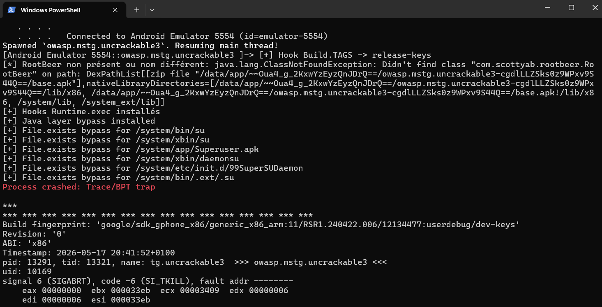
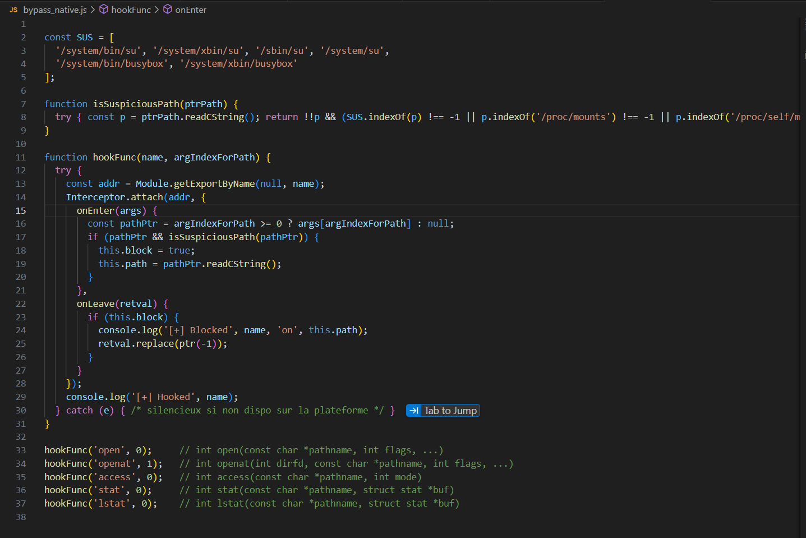
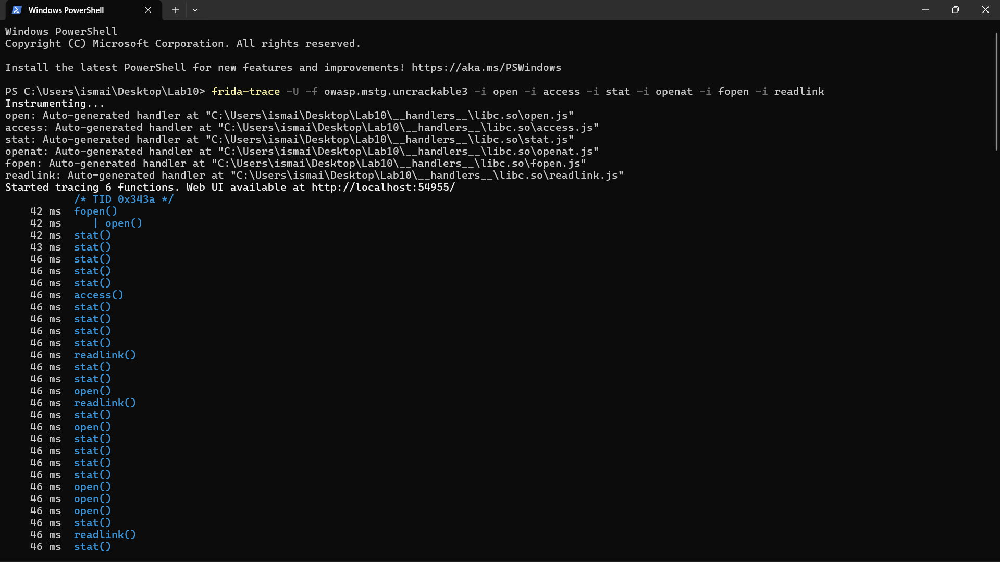
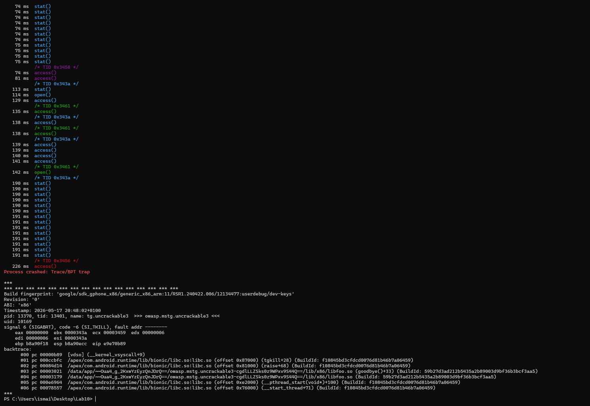

# Lab_10_MobileSecurity

## Objectif
L'objectif de ce laboratoire est de comprendre le fonctionnement des mécanismes de sécurité des applications Android (détection de root, anti-debug) et d'utiliser Frida pour les contourner dynamiquement. Le but final est de réussir à exécuter une application sécurisée en neutralisant ses protections à la fois au niveau Java et au niveau natif (C/C++).

## 1. Préparation et environnement
Pour commencer, il fallait s'assurer de la bonne communication entre la machine hôte et l'émulateur. J'ai d'abord vérifié les versions des outils et la connectivité ADB.

Ensuite, j'ai déployé et lancé `frida-server` sur l'appareil. La commande `frida-ps -Uai` m'a permis de lister les processus en cours et de cibler l'application à analyser (Uncrackable).

## 2. Contournement au niveau Java
La première ligne de défense de l'application repose sur des appels Java (vérification du `Build.TAGS`, recherche des binaires `su` et `busybox`, etc.). J'ai donc rédigé un script JavaScript (`bypass_root.js`) pour "hooker" ces appels système.

Lors du lancement de Frida avec ce script, les logs confirment que les accès aux fichiers suspects ont bien été interceptés et bloqués, renvoyant de fausses informations à l'application.

## 3. Analyse de la sécurité native
Malgré le contournement Java, l'application crashe à cause d'une sécurité supplémentaire intégrée dans sa bibliothèque native (C/C++). Pour comprendre ce qui déclenche le crash, j'ai utilisé l'outil `frida-trace`.

Cet outil a permis d'intercepter les appels système de bas niveau (comme `open`, `openat`, `access`) et de voir précisément quels fichiers l'application cherchait à lire en arrière-plan.

## 4. Contournement final (Natif et Anti-Frida)
Pour vaincre complètement la sécurité, j'ai implémenté deux autres scripts :
- `bypass_native.js` : pour neutraliser les appels natifs identifiés lors de l'analyse précédente.
- `anti_frida.js` : pour empêcher l'application de détecter la présence même de Frida en mémoire ou sur les ports réseau.

L'exécution combinée des trois scripts montre le succès total de l'opération : l'ensemble des vérifications sont bloquées, et l'application reste stable sans détecter le root ni l'instrumentation.

L'application s'ouvre enfin normalement sur l'émulateur.

## Conclusion
Ce lab montre l'efficacité de l'instrumentation dynamique pour analyser et altérer le comportement des applications en temps réel. Il met également en évidence qu'une sécurité uniquement basée sur le côté client n'est pas infaillible, qu'elle soit implémentée en Java ou au niveau natif.
