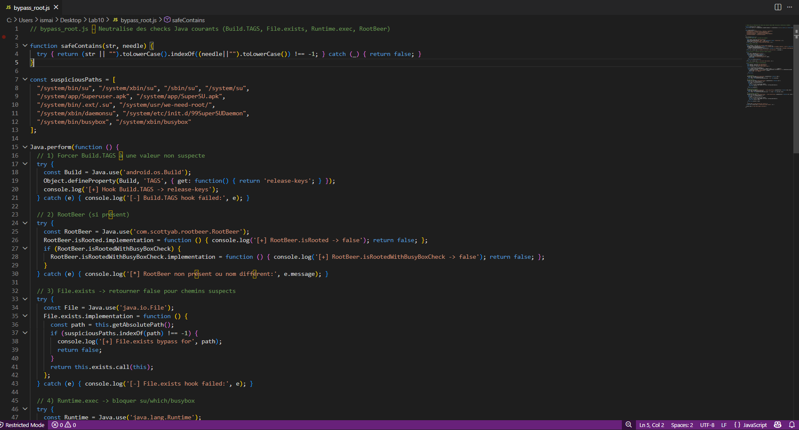
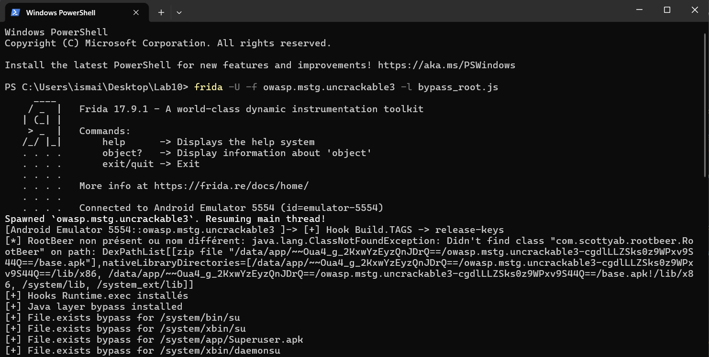
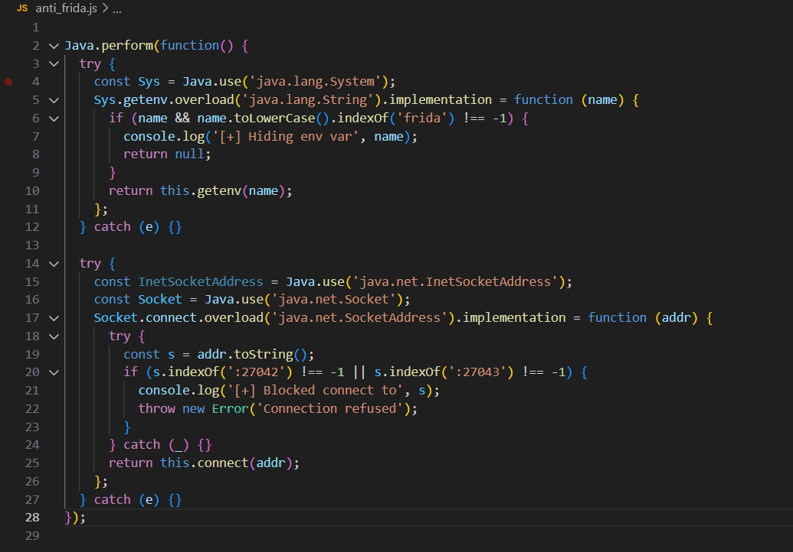
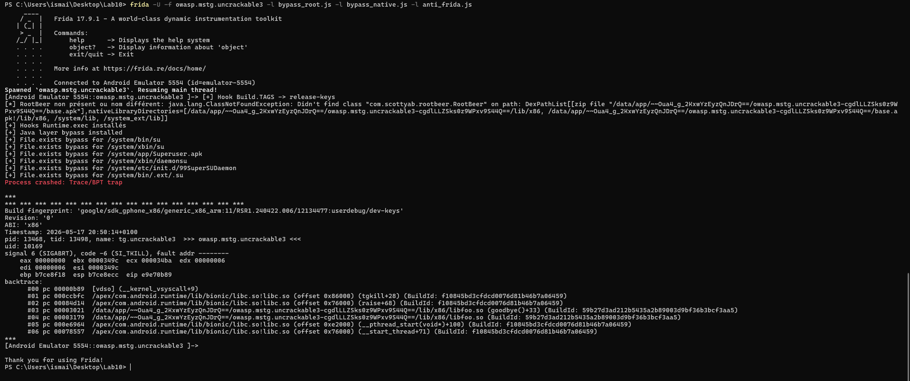

# Lab 10 : Détection et Contournement Root avec Frida

## Objectif
Utiliser Frida pour comprendre et neutraliser les systèmes de détection root d'une application Android sécurisée.

## Contexte
Les applications vérifient si un téléphone est rooté via des vérifications Java et C/C++ (couche native). L'idée est d'intercepter et de modifier ces vérifications au vol pour forcer l'application à démarrer normalement.

## Étapes essentielles

### 1. Installation et preuve
- **Explication :** Vérification des outils nécessaires (Frida, ADB) sur la machine.
- **Action réalisée :** Exécution des commandes pour vérifier la version de Frida et s'assurer que le téléphone virtuel est bien détecté par ADB.
- **Capture associée :**

### 2. Déploiement et visibilité
- **Explication :** Lancement du serveur Frida sur l'appareil Android et test de connexion.
- **Action réalisée :** Lancement de `frida-server` en arrière-plan et utilisation de `frida-ps -Uai` pour lister au moins 3 applications en cours (dont notre cible Uncrackable).
- **Capture associée :**

### 3. Bypass Java
- **Explication :** Contournement des vérifications de sécurité au niveau Java (ex: détection de `su`, `busybox`, `Build.TAGS`).
- **Action réalisée :** Injection du script `bypass_root.js`. Les logs confirment le blocage des vérifications Java (`[+] File.exists bypass`), même si l'application déclenche ensuite une autre sécurité.
- **Captures associées :**

### 4. Natif/Trace
- **Explication :** Détection et blocage des appels systèmes bas niveau (C/C++) utilisés par l'application pour chercher les traces de root.
- **Action réalisée :** Lancement de `frida-trace` pour identifier les appels (`open`, `access`, `stat`), puis exécution des scripts `bypass_native.js` et `anti_frida.js` pour bloquer ces accès (`[+] Blocked...`).
- **Captures associées :**

## Résultat final
En lançant l'application avec la combinaison complète des scripts de contournement (`bypass_root.js`, `bypass_native.js`, et `anti_frida.js`), toutes les couches de sécurité sont vaincues simultanément. L'application s'exécute normalement de manière stable sans détecter le root ou notre outil d'analyse.

## Conclusion
Ce lab prouve que la sécurité côté client n'est jamais absolue. Même lorsqu'une application croise des vérifications hybrides (Java + Natif), un outil d'instrumentation dynamique tel que Frida permet de manipuler la mémoire et de modifier les réponses du système en temps réel, rendant les défenses inefficaces.
